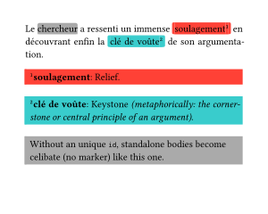
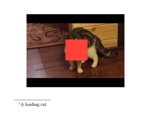
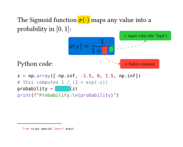
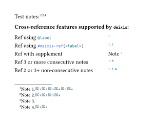

deixis [](https://typst.app/universe/package/deixis) [](LICENSE) [][manual]
------

Decoupled annotations for [Typst](https://typst.app/).

`deixis` is a unified layout engine for footnotes, endnotes, margin notes, inset notes, inline highlights, and spatial annotations.

> _under development, expect bugs_

## Main Features

- **Marks:**
  - [Inline mark](#inline-mark-and-inline-note)
  - Phantom mark
  - [Region mark](#pin-and-region-mark)
- **Notes:**
  - [Inline note](#inline-mark-and-inline-note)
  - [Footnote](#footnote)
  - [Endnote](#endnote)
  - [Margin note](#margin-note)
  - [Inset note](#inset-note)
- [Cross-reference & bi-directional backlinks](#cross-reference-and-backlink)
- [Note outline](#note-outline)

## Installation

### From Typst Universe

This package is yet available in the Typst Universe.
When it is officially released, you will be able to download and use it by simply adding the following line to your document.

```typst
#import "@preview/deixis:0.1.0": *
```

### Local Use

For local use, first you need to clone the repo and run the install script:

```bash
git clone https://github.com/inspiros/deixis
python scripts/install.py
 ```

This Python script stores the package files in the right location following the instructions [here](https://github.com/typst/packages?tab=readme-ov-file#local-packages).
Once installed, you can import the package with:

```typst
#import "@local/deixis:0.1.0": *
```

## Usage and Examples

For detailed information, please see the [manual (PDF)][manual].

No `deixis` functionality can be used before applying this setup show rule:

```typst
#show: deixis-setup-notes
```

### Inline Mark and Inline Note

<div align="center">

</div>

<details>
<summary><b>Show Typst Source Code</b></summary>

````typst
#set par(justify: true)

Le
#deixis-inline-mark(  // celibate mark
  inline-mode: "underline",
  stroke: gray,
  fill: gray.transparentize(90%),
)[chercheur]
a ressenti un immense
#deixis-inline-mark(id: <soulagement>,
  stroke: red,
  fill: red.transparentize(95%),
)[soulagement]
en découvrant enfin la
#deixis-inline-mark(id: <cle-de-voute>,
  stroke: teal,
  fill: teal.transparentize(95%),
)[clé de voûte]
de son argumentation.

#deixis-inline-note-body(id: <soulagement>)[
  *soulagement*: Relief.
]
#deixis-inline-note-body(id: <cle-de-voute>)[
  *clé de voûte*: Keystone _(metaphorically: the cornerstone or central principle of an argument)_.
]
#deixis-inline-note-body(  // celibate note
  stroke: gray,
  fill: gray.transparentize(95%),
)[
  Without an unique `id`, standalone bodies become celibate (no marker) like this one.
]
````

</details>

### Footnote

<div align="center">

</div>

<details>
<summary><b>Show Typst Source Code</b></summary>

````typst
#lorem(10)
#deixis-footnote[A plain footnote.]
#lorem(10)
#deixis-footnote(marker: lorem(2))[
  A footnote with very long marker, aligned with other notes.
]
#deixis-footnote-body[
  A celibate footnote body without linked mark.
]

#lorem(10)
#deixis-footnote(
  marker-style: (body: it => text(fill: orange, super(it))),
  stroke: red,
  fill: red.transparentize(95%),
  container-func: deixis-alert-container,
)[A marked text][A colorful footnote.].
````

</details>

### Endnote

<div align="center">

</div>

<details>
<summary><b>Show Typst Source Code</b></summary>

````typst
#lorem(10)
#deixis-endnote[A plain endnote.]
#lorem(10)
#deixis-endnote(
  stroke: maroon,
  fill: maroon.transparentize(90%),
)[
  Endnotes use a different counter
][
  They default to the `"endnote"` series.
].
#lorem(10)
// print all previous notes
#deixis-print-endnotes()

#lorem(5)
#deixis-endnote[
  ```typst #deixis-print-endnotes()``` flushes out unprinted notes by default, but it can do more than that.
]
#box()<split>
This
#deixis-endnote(
  stroke: gray,
  fill: none,
)[
  invisible note
][
  This note is not supposed to be printed.
]
is added after the label ```typst #box()<split>```.
// print with filter
#deixis-print-endnotes(before: <split>)
````

</details>

### Margin Note

<div align="center">

</div>


<details>
<summary><b>Show Typst Source Code</b></summary>

````typst
#lorem(10)
#deixis-margin-note[A plain margin note.]
#lorem(10)
// use rect container for subsequent notes
#deixis-set(container-func: (margin-note: rect))
#deixis-margin-note(
  stroke: teal,
  fill: teal.transparentize(95%),
  link: "right-angle",
)[][A colorful margin note.]
#deixis-margin-note(
  stroke: green,
  fill: green.transparentize(95%),
  link: "right-angle",
  mark-align: (mark: horizon, body: horizon),
)[This is a marked text][A left side note, aligned horizontally to its mark.].
#lorem(10)
#deixis-margin-note(
  inline-mode: "highlight",
  stroke: (link: stroke(paint: orange, dash: "dashed"), body: orange),
  fill: (mark: orange.transparentize(80%), body: orange.transparentize(95%)),
  side: right,
  link: "curve",
)[Another highlighted text][A note with different styling.].

#import "@preview/colorful-boxes:1.4.3": stickybox

#lorem(3)
#deixis-margin-note(
  fill: blue.lighten(85%),
  container-func: (body, ..args) => stickybox(body, fill: args.at("fill"), rotation: args.at("rotation", default: 0deg)),
  rotation: 10deg,  // all unknown named parameters are passed to container-func
)[Sticky note.]
#lorem(5)
#deixis-margin-note(
  marker: "",
  stroke: red,
  fill: red.transparentize(95%),
  link: "right-angle",
)[A note with empty marker.]
#lorem(5)
````

</details>

### Inset Note

<div align="center">

</div>

<details>
<summary><b>Show Typst Source Code</b></summary>

````typst
#lorem(12)
#deixis-inset-note(
  stroke: orange,
  fill: yellow.transparentize(90%),
  link: "right-angle",
  link-ports: (mark: right, body: bottom),
  link-marks: "both",
  placement: body => deixis-absolute-place(top + right, dx: -5pt, dy: 5pt, body),
)[A marked text][A placed note].

- #lorem(2)
- #lorem(3)#deixis-inset-note(
  marker: none,
  stroke: red,
  fill: red.transparentize(95%),
  link: "straight-line",
  link-marks: "mark",
  width: 4.5cm,
  dx: 1em,
  dy: 0pt,
  anchor: (mark: right + horizon, body: left + horizon),
  layer: "flow",
)[Alternatively, use `dx`, `dy`, and `anchor` to align the body.]

#import "@preview/meander:0.4.2"
#import "@preview/colorful-boxes:1.4.3": outline-colorbox

#let note-body = deixis-inset-note-body(
  id: <meander>,
  layer: "flow",  // important !!!
  width: 60%,
  stroke: purple,
  fill: purple.transparentize(95%),
  container-func: (body, ..args) => outline-colorbox(body,
    color: (stroke: args.at("stroke").paint, fill: args.at("fill")),
    stroke: args.at("stroke").thickness,
    title: args.at("title", default: [Note])),
  title: [`meander` note],
)[A _true_ inset note.]
#meander.reflow({
  import meander: *

  placed(horizon + right, note-body)
  container()
  content[
    #set par(justify: true)
    #lorem(21)
    #deixis-inline-mark(id: <meander>)  // linked via id
    #lorem(21)
  ]
})
````

</details>

### Pin and Region Mark

<table>
<tr>
  <td width="50%">

<div align="center">

</div>

  </td>
  <td width="50%">

<div align="center">

</div>

  </td>
</tr>
</table>

<details>
<summary><b>Show Typst Source Code</b></summary>

<table>
<tr>
  <td width="50%">

````typst
#align(center,
  deixis-attach(
  pins: (
    cat-top-left: (dx: 40%, dy: 35%),
    cat-bottom-right: (dx: 62%, dy: 63%),
  )
)[
  #image("assets/loading-cat.jpg", width: 80%)
])

#deixis-region-mark(
  id: <cat>,
  pins: ("cat-top-left", "cat-bottom-right"),
  marker-style: (mark: it => text(fill: white, super(it))),
  marker-position: top + center,
  stroke: red,
  fill: red.transparentize(90%),
)
#deixis-footnote-body(
  id: <cat>,
)[A loading cat.]
````

  </td>
  <td width="50%">

````typst
The Sigmoid function
#deixis-region-mark(
  stroke: yellow,
  fill: yellow.transparentize(95%),
  inline: true,
  layer: "background",
)[$sigma(dot)$]
maps any value into a probability in $[0, 1]$:

#align(center,  // wrapped equations cannot auto align center
  deixis-region-mark(
  stroke: blue,
  fill: blue.transparentize(95%),
  padding: "text",
  layer: "background",
)[
$ sigma(z) = frac(1, 1 + #deixis-pin("e-left")e#deixis-pin("e-right")^(-#deixis-pin("z-left")z#deixis-pin("z-right"))) $
])
#deixis-set(
  body-style: it => text(size: 0.6em, it),
  side-strategy: "strict",
  container-func: (margin-note: rect),
)
#deixis-inset-note(
  pins: ("z-left", "z-right"),
  marker-style: it => text(fill: green, super(it)),
  stroke: (rest: green, link: stroke(paint: green, thickness: 0.5pt, dash: "dashed")),
  fill: green.transparentize(95%),
  link: "curve",
  link-ports: (body: bottom),
  link-marks: "body",
  dx: 1em,
  dy: -2em,
)[
  $z$: input value (the "logit").
]
#deixis-inset-note(
  pins: ("e-left", "e-right"),
  marker-style: it => text(fill: red, super(it)),
  stroke: (rest: red, link: stroke(paint: red, thickness: 0.5pt, dash: "dashed")),
  fill: red.transparentize(95%),
  link: "curve",
  link-ports: (mark: bottom, body: left),
  link-marks: "body",
  dx: 2em,
  dy: 2em,
)[
  $e$: Euler's constant.
]
Python code:

#deixis-set-pin-pattern(
  prefix: "deixispin",
  postfix: "deixis",
)
#deixis-attach(
```python
z = np.array([-np.inf, -1.5, 0, 1.5, np.inf])
# this computes 1 / (1 + exp(-z))
probability = deixispine0deixisexpitdeixispine1deixis(z)
print(f"Probability:\n{probability}")
```
)
#deixis-footnote(
  pins: ("e0", "e1"),
  marker-style: it => text(fill: teal, super(it)),
  stroke: teal,
  fill: teal.transparentize(95%),
)[```python from scipy.special import expit```]
````

  </td>
</tr>
</table>

</details>

---

### Cross-reference and Backlink

<div align="center">

</div>

<details>
<summary><b>Show Typst Source Code</b></summary>

````typst
Test notes:
#deixis-footnote(
  label: <note-1>,
  backlink: true,
  marker-style: (mark: it => text(fill: red, super(it))),
)[Note 1.]
#deixis-footnote(
  label: <note-2>,
  backlink: "always",  // equivalent to true
  marker-style: (mark: it => text(fill: blue, super(it))),
)[Note 2.]
#deixis-footnote(
  label: <note-3>,
  backlink: "none",  // equivalent to false
)[Note 3.]
#deixis-footnote(
  label: <note-4>,
  backlink: "multiple",  // only if they are ref-ed at least once
)[Note 4.]

*Cross-reference features supported by `deixis`:*
#grid(
  align: left,
  columns: (3fr, 1fr),
  row-gutter: 0.8em,
  stroke: none,
  [Ref using ```typst @label```], [#deixis-ref(<note-1>)],
  [Ref using ```typst #deixis-ref(<label>)```], [#deixis-ref(<note-1>, <note-2>)],
  [Ref with supplement], [@note-1[Note]],
  [Ref 3 or more consecutive notes], [#deixis-ref(<note-1>, <note-2>, <note-3>)],
  [Ref 2 or 3+ non-consecutive notes], [#deixis-ref(<note-1>, <note-2>, <note-4>)]
)
````

</details>

### Note Outline

<div align="center">

</div>

<details>
<summary><b>Show Typst Source Code</b></summary>

````typst
#deixis-inline-mark(
  id: <celibate>,  // linked to no note body
)[A celibate marked text]
#deixis-footnote(
  stroke: gray,
)[A footnote.]
#deixis-endnote(
  stroke: green,
  fill: green.transparentize(95%),
  numbering: "i",
)[An endnote.]
#deixis-margin-note(
  stroke: orange,
  fill: orange.transparentize(95%),
  container-func: rect,
)[A margin note.]
#deixis-inset-note(
  stroke: blue,
  fill: blue.transparentize(95%),
  placement: body => deixis-absolute-place(top + left, dx: 5pt, dy: 5pt, body),
)[An inset note.]

#deixis-note-outline(
  fill: repeat[.],
  include-celibates: "mark",
)
````

</details>

## Acknowledgements

This package has some similar functionalities inspired by existing packages:
- [drafting](https://github.com/ntjess/typst-drafting): Margin note, without numbering.
- [marge](https://github.com/EpicEricEE/typst-marge): Margin note, without links.
- [pinit](https://github.com/OrangeX4/typst-pinit): Equivalent to region mark and inset note, without numbering.
- [Rik's endnote](https://forum.typst.app/t/an-endnotes-implementation-with-headings-and-cross-referencing/7760): An early attempt to implement endnote.

## License

MIT licensed, see [LICENSE](LICENSE).

[manual]: docs/manual.pdf
