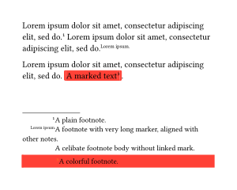
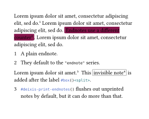
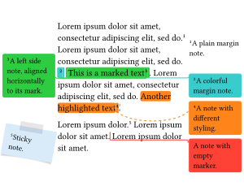
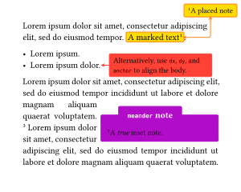
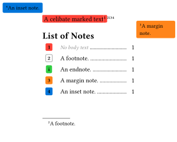

deixis [](https://typst.app/universe/package/deixis) [](LICENSE) [][manual]
------

Decoupled annotations for [Typst](https://typst.app/).

`deixis` is a unified layout engine for footnotes, endnotes, margin notes, inset notes, inline highlights, and spatial annotations.

## Installation

### From Typst Universe

This package is yet available in the Typst Universe.
When it is officially released, you will be able to download and use it by simply adding the following line to your document.

```typst
#import "@preview/deixis:0.1.0": *
```

### Local Use

For local use, first you need to clone the repo and run the install script:

```bash
git clone https://github.com/inspiros/deixis
python scripts/install.py
 ```

This Python script stores the package files in the right location following the instructions [here](https://github.com/typst/packages?tab=readme-ov-file#local-packages).
Once installed, you can import the package with:

```typst
#import "@local/deixis:0.1.0": *
```

## Usage

For detailed information, please see the [manual (PDF)][manual].

### Setup

No `deixis` functionality can be used before applying this setup show rule:

```typst
#show: deixis-setup-notes
```

### Examples

#### Inline Mark and Inline Note

<div align="center">

</div>

<details>
<summary><b>Show Typst Source Code</b></summary>

```typst
#set par(justify: true)

Enfin, le chercheur a ressenti un immense
#deixis-inline-mark(id: <soulagement>,
  stroke: red,
  fill: red.transparentize(95%),
)[soulagement]
en découvrant enfin la
#deixis-inline-mark(id: <cle-de-voute>,
  stroke: teal,
  fill: teal.transparentize(95%),
)[clé de voûte]
de son argumentation.

#deixis-inline-note-body(id: <soulagement>)[
  *soulagement*: Relief.
]
#deixis-inline-note-body(id: <cle-de-voute>)[
  *clé de voûte*: Keystone _(metaphorically: the cornerstone or central principle of an argument)_.
]
#deixis-inline-note-body(
  stroke: gray,
  fill: gray.transparentize(95%),
)[
  A celibate inline note.
]
```

</details>

#### Footnote

<div align="center">

</div>

<details>
<summary><b>Show Typst Source Code</b></summary>

```typst
#lorem(10)
#deixis-footnote[A plain footnote.]
#lorem(10)
#deixis-footnote(marker: lorem(2))[A note with long marker and body content.]
#lorem(10)
#deixis-footnote(
  marker-style: (body: it => text(fill: orange, super(it))),
  stroke: red,
  fill: red.transparentize(95%),
  container-func: deixis-alert-container,
)[A marked text][A colorful footnote.].
```

</details>

#### Endnote

<div align="center">

</div>

<details>
<summary><b>Show Typst Source Code</b></summary>

```typst
#lorem(10)
#deixis-endnote[A plain endnote.]
#lorem(10)
#deixis-endnote(
  stroke: maroon,
  fill: maroon.transparentize(90%),
)[
  Endnotes use a different counter
][
  They default to the `"endnote"` series.
].
#lorem(10)
// print endnote bodies
#deixis-print-endnotes()

#lorem(5)
#deixis-endnote[
  ```typst #deixis-print-endnotes()``` flushes out unprinted notes _(and it can do more than that)_.
]
#deixis-print-endnotes()
```

</details>

#### Margin Note

<div align="center">

</div>


<details>
<summary><b>Show Typst Source Code</b></summary>

```typst
#deixis-set(margin-layout: "adaptive")

#lorem(10)
#deixis-margin-note[A plain margin note.]
#lorem(10)
// use rect container for subsequent notes
#deixis-set(container-func: (margin-note: rect))
#deixis-margin-note(
  stroke: teal,
  fill: teal.transparentize(95%),
  link: "right-angle",
)[][A colorful margin note.]
#deixis-margin-note(
  stroke: green,
  fill: green.transparentize(95%),
  link: "right-angle",
  mark-align: (mark: horizon, body: horizon),
)[This is a marked text][A left side note, aligned horizontally to its mark.].
#lorem(10)
#deixis-margin-note(
  inline-mode: "highlight",
  stroke: (link: stroke(paint: orange, dash: "dashed"), body: orange),
  fill: (mark: orange.transparentize(80%), body: orange.transparentize(95%)),
  side: right,
  link: "curve",
)[Another highlighted text][A note with different styling.].

#import "@preview/colorful-boxes:1.4.3": stickybox

#lorem(3)
#deixis-margin-note(
  fill: blue.lighten(85%),
  container-func: (body, ..args) => stickybox(body, fill: args.at("fill"), rotation: args.at("rotation", default: 0deg)),
  rotation: 10deg,  // all unknown named parameters are passed to container-func
)[Sticky note.]
#lorem(5)
#deixis-margin-note(
  marker: "",
  stroke: red,
  fill: red.transparentize(95%),
  link: "right-angle",
)[A note with empty marker.]
#lorem(5)
```

</details>

#### Inset Note

<div align="center">

</div>

<details>
<summary><b>Show Typst Source Code</b></summary>

```typst
#lorem(10)
#deixis-inset-note(
  stroke: orange,
  fill: yellow.transparentize(90%),
  link: "curve",
  link-ports: (mark: right, body: bottom),
  link-marks: "both",
  placement: body => deixis-absolute-place(top + right, dx: -5pt, dy: 5pt, body),
)[A marked text][A placed note].

- #lorem(2)
- #lorem(3)#deixis-inset-note(
  marker: none,
  stroke: red,
  fill: red.transparentize(95%),
  link: "straight-line",
  link-marks: "mark",
  width: 4.5cm,
  dx: 1em,
  dy: 0pt,
  anchor: (mark: right + horizon, body: left + horizon)
)[Alternatively, use `dx`, `dy`, and `anchor` to align the body.]

#import "@preview/meander:0.4.2"
#import "@preview/colorful-boxes:1.4.3": outline-colorbox

#let note-body = deixis-inset-note-body(
  id: <meander>,
  width: 60%,
  stroke: purple,
  fill: purple.transparentize(95%),
  container-func: (body, ..args) => outline-colorbox(body,
    color: (stroke: args.at("stroke").paint, fill: args.at("fill")),
    stroke: args.at("stroke").thickness,
    title: args.at("title", default: [Note])),
  title: [Inset Note],
)[A _true_ inset note.]
#meander.reflow({
  import meander: *

  placed(horizon + right, note-body)
  container()
  content[
    #set par(justify: true)
    #lorem(15)
    #deixis-inline-mark(id: <meander>)  // linked via id
    #lorem(18)
  ]
})
```

</details>

#### Note Outline

<div align="center">

</div>

<details>
<summary><b>Show Typst Source Code</b></summary>

```typst
#deixis-inline-mark(
  id: <celibate>,  // linked to no note body
)[A celibate marked text]
#deixis-footnote(
  stroke: gray,
)[A footnote.]
#deixis-endnote(
  stroke: green,
  fill: green.transparentize(95%),
  numbering: "i",
)[An endnote.]
#deixis-margin-note(
  stroke: orange,
  fill: orange.transparentize(95%),
  container-func: rect,
)[A margin note.]
#deixis-inset-note(
  stroke: blue,
  fill: blue.transparentize(95%),
  placement: body => deixis-absolute-place(top + left, dx: 5pt, dy: 5pt, body),
)[An inset note.]

#deixis-note-outline(
  fill: repeat[.],
  include-celibates: "mark",
)
```

</details>

## Acknowledgements

This package has some similar functionalities inspired by existing packages:
- [drafting](https://github.com/ntjess/typst-drafting): Margin note, without numbering.
- [marge](https://github.com/EpicEricEE/typst-marge): Margin note, without links.
- [pinit](https://github.com/OrangeX4/typst-pinit): Equivalent to region mark and inset note, without numbering.
- [Rik's endnote](https://forum.typst.app/t/an-endnotes-implementation-with-headings-and-cross-referencing/7760): An early attempt to implement endnote.

## License

MIT licensed, see [LICENSE](LICENSE).

[manual]: docs/manual.pdf
